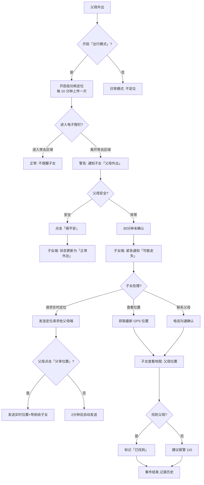

# 原型设计：防走失钥匙（防走失 + 位置共享）

**项目**：父母这一周  
**场景**：居家安全 - 防走失  
**优先级**：P0（安全底线）  
**日期**：2026-04-16  
**状态**：设计草案

---

## 🎯 场景定义

### 核心问题
- 父母外出迷路，无法回家
- 阿尔茨海默症患者走失风险高
- 子女无法实时定位（隐私顾虑）
- 手机没电/关机无法联系

### 解决方案
「防走失钥匙」：基于微信位置能力 + 低功耗定位 + 紧急求助按钮

### 设计原则
- **被动定位为主**：只在异常时获取位置，减少耗电
- **主动求助为辅**：父母端一键发送位置
- **隐私保护**：位置有效期 2 小时自动过期
- **离线可用**：紧急呼叫支持离线（电话功能）

---

## 🔄 完整流程图（Mermaid）



---

## 📱 页面线框图与说明

### 页面 1：出行模式开关（父母端 - TabBar「每日小结」）

```
┌─────────────────────────────────┐
│ ← 每日小结        🏠 在家      │
├─────────────────────────────────┤
│                                 │
│ 今日状态                        │
│ ┌───────────────────────────┐ │
│ │  🟢 安全  🏠 在家         │ │
│ │  最后更新: 10 分钟前      │ │
│ └───────────────────────────┘ │
│                                 │
│ 出行模式                        │
│ ┌───────────────────────────┐ │
│ │  外出                    │ │
│ │  ○ 在家   ● 外出          │ │
│ │                           │ │
│ │  开启后:                 │ │
│ │  • 每 10 分钟上传位置     │ │
│ │  • 离开小区提醒子女       │ │
│ │  • 电量低于 20% 提醒      │ │
│ └───────────────────────────┘ │
│                                 │
│ 紧急求助                        │
│ ┌───────────────────────────┐ │
│ │  🆘 一键求助              │ │
│ │  发送位置 + 呼叫子女       │ │
│ └───────────────────────────┘ │
│                                 │
│ 常去区域（由子女设置）          │
│ • 小区 (500m 范围)             │
│ • 菜市场 (300m 范围)           │
│ • 老年活动中心 (800m 范围)     │
│                                 │
└─────────────────────────────────┘
```

**说明**：
- 父母点击「外出」 → 开启定位（每 10 分钟）
- 离开常去区域（电子围栏） → 自动通知子女
- 电量低于 20% → 提醒子女和父母
- 红色「一键求助」按钮始终可见

---

### 页面 2：安全看板（子女端 - 新增页面）

```
┌─────────────────────────────────┐
│ ← 父母安全状态                 │
├─────────────────────────────────┤
│                                 │
│ 👨 父亲                         │
│ ────────────────────────────   │
│ 🟢 状态: 安全                  │
│ 📍 位置: 在家                   │
│ 🔋 电量: 85%                   │
│ ⏰ 最后更新: 2 分钟前           │
│                                 │
│ 👩 母亲                         │
│ ────────────────────────────   │
│ 🟡 状态: 外出（未确认）        │
│ 📍 位置: 公园 (2.3km)          │
│ 🔋 电量: 32% ⚠️               │
│ ⏰ 最后更新: 15 分钟前          │
│                                 │
│ [查看地图] [历史轨迹]          │
│                                 │
│ ┌───────────────────────────┐ │
│ │ ⚠️ 最近异常事件            │ │
│ │ 4月14日 父亲离开小区未报备 │ │
│ │ 4月12日 母亲电量低于 20%   │ │
│ └───────────────────────────┘ │
│                                 │
└─────────────────────────────────┘
```

**状态说明**：
- 🟢 绿色：安全（在家或已报备外出）
- 🟡 黄色：外出未确认（需关注）
- 🔴 红色：异常（可能走失，超时未确认）

---

### 页面 3：地图追踪（子女端）

```
┌─────────────────────────────────┐
│ ← 父母位置                     │
├─────────────────────────────────┤
│                                 │
│    [地图显示]                   │
│    📍 父母当前位置              │
│    公园 2.3km · 移动中          │
│                                 │
│ ┌───────────────────────────┐ │
│ │ 🧭 导航前往               │ │
│ │ 📞 呼叫父母                │ │
│ │ 💬 发送消息「你在哪」      │ │
│ │ 🆘 紧急求助（110）         │ │
│ └───────────────────────────┘ │
│                                 │
│ 历史轨迹: 今日                  │
│ 08:00 家 → 09:30 公园 → 11:00 家│
│                                 │
└─────────────────────────────────┘
```

**功能**：
- 实时地图显示父母位置（每 10 分钟更新）
- 一键导航前往（调用高德/百度地图）
- 查看历史轨迹（最近 7 天）
- 紧急呼叫 110（需授权）

---

### 页面 4：电子围栏管理（子女端 - 设置页子项）

```
┌─────────────────────────────────┐
│ ← 常去区域设置                 │
├─────────────────────────────────┤
│                                 │
│ 什么是电子围栏?                 │
│ 当父母进入或离开这些区域时，   │
│ 你会收到提醒。                  │
│                                 │
│ ┌───────────────────────────┐ │
│ │ 🏠 家                     │ │
│ │ 范围: 500 米              │ │
│ │ 地址: XX小区12栋           │ │
│ │ 编辑  [删除]              │ │
│ └───────────────────────────┘ │
│                                 │
│ ┌───────────────────────────┐ │
│ │ 🛒 菜市场                 │ │
│ │ 范围: 300 米              │ │
│ │ 地址: 幸福路菜市场         │ │
│ │ 编辑  [删除]              │ │
│ └───────────────────────────┘ │
│                                 │
│ + 添加新区域                    │
│                                 │
└─────────────────────────────────┘
```

**操作**：
- 添加区域：地图选点 + 设置半径（100/300/500/1000m）
- 编辑：调整范围、重命名
- 删除：移除监控区域

---

## 💾 数据模型

### Collection: `location_history`
```json
{
  "_id": "loc_001",
  "parentId": "user_parent_123",
  "timestamp": "2026-04-15T09:30:00Z",
  "type": "gps",  // gps/wifi/beidou
  "latitude": 39.9042,
  "longitude": 116.4074,
  "accuracy": 20,  // 精度（米）
  "source": "parent_manual",  // auto_10min/manual/sos
  "batteryLevel": 85,
  "isOutdoor": true
}
```

### Collection: `geo_fences`
```json
{
  "_id": "fence_001",
  "parentId": "user_parent_123",
  "childId": "user_child_456",
  "name": "家",
  "address": "XX小区12栋",
  "latitude": 39.9042,
  "longitude": 116.4074,
  "radius": 500,  // 米
  "notifyEntry": true,  // 进入提醒
  "notifyExit": true,  // 离开提醒
  "createdAt": "2026-04-01T00:00:00Z"
}
```

### Collection: `sos_events`
```json
{
  "_id": "sos_001",
  "parentId": "user_parent_123",
  "type": "location_request",  // location_request/emergency_call
  "location": {
    "latitude": 39.9042,
    "longitude": 116.4074
  },
  "timestamp": "2026-04-15T10:00:00Z",
  "childNotified": ["user_child_456"],
  "responseTime": 45,  // 子女响应时间（秒）
  "resolved": true
}
```

---

## ☁️ 云函数设计

### 云函数：`location`（父母端调用）

**功能**：上传位置、查询围栏状态

```javascript
exports.main = async (event) => {
  const { action, parentId, latitude, longitude } = event;
  
  if (action === 'upload') {
    // 1. 保存位置记录
    await db.collection('location_history').add({
      data: {
        parentId, latitude, longitude,
        timestamp: new Date(),
        batteryLevel: event.batteryLevel
      }
    });
    
    // 2. 检查电子围栏
    const fences = await db.collection('geo_fences')
      .where({ parentId }).get();
    
    const violations = [];
    for (let fence of fences) {
      const distance = calcDistance(latitude, longitude, fence.latitude, fence.longitude);
      if (distance > fence.radius) {
        violations.push({ fence, distance });
      }
    }
    
    // 3. 触发通知（如有异常）
    if (violations.length > 0) {
      await notifyChild(parentId, 'left_fence', violations);
    }
    
    return { success: true, violations };
  }
  
  if (action === 'sos') {
    // 紧急求助：发送位置 + 呼叫
    await db.collection('sos_events').add({ data: { ...event, timestamp: new Date() } });
    await notifyChild(parentId, 'sos', { location: {latitude, longitude} });
    return { success: true };
  }
};
```

---

### 云函数：`child-location-request`（子女端调用）

**功能**：请求父母实时位置

```javascript
exports.main = async (event) => {
  const { childId, parentId } = event;
  
  // 1. 发送定位请求给父母
  await sendMessageToParent(parentId, {
    type: 'location_request',
    from: childId,
    timestamp: new Date()
  });
  
  // 2. 启动超时计时（2 分钟）
  setTimeout(async () => {
    const response = await checkParentResponse(parentId, childId);
    if (!response) {
      // 自动发送最后已知位置
      const lastLoc = await getLastLocation(parentId);
      await notifyChild(childId, 'auto_location', lastLoc);
    }
  }, 120000);
  
  return { success: true };
};
```

---

## 🔋 低功耗策略

### 定位模式切换

| 模式 | 触发条件 | 定位频率 | 预计耗电 |
|------|----------|----------|----------|
| **日常模式** | 在家/常去区域 | 不定位 | 0%/天 |
| **外出模式** | 手动开启/自动检测 | 每 10 分钟 | 3-5%/天 |
| **异常模式** | 离开围栏未确认 | 每 5 分钟 | 8-10%/天 |
| **SOS 模式** | 点击求助 | 连续 1 分钟 | 15%/次 |

**优化措施**：
- 优先使用 Wi-Fi 定位（低功耗）
- GPS 仅在需要高精度时启用
- 位置缓存机制（避免重复上传）

---

## 📊 关键指标（Success Metrics）

| 指标 | 目标值 | 测量方法 |
|------|--------|----------|
| 定位准确率 | > 90% | 对比 GPS 实际位置 |
| 围栏触发延迟 | < 2 分钟 | 进出区域到通知时间 |
| 子女响应时间 | < 5 分钟 | SOS 事件到子女查看 |
| 误报率 | < 5% | 正常外出被标记为异常 |
| 耗电量 | < 5%/天 | 外出模式持续 8 小时 |

---

## ⚠️ 边界情况处理

| 场景 | 处理方式 |
|------|----------|
| 父母手机没电 | 电量 < 20% 时提前 1 小时通知子女 |
| 父母拒绝定位 | 记录拒绝事件，不强制（隐私优先） |
| 网络中断 | 本地缓存，网络恢复后批量上传 |
| GPS 信号弱 | 使用 Wi-Fi/基站定位，降低精度预期 |
| 多个子女绑定 | 所有子女同时收到通知（可配置接收人） |

---

## 🎨 原型设计完成清单

- [x] 完整流程图（Mermaid）
- [x] 4 个页面线框图（出行开关、安全看板、地图追踪、围栏管理）
- [x] 数据模型（3 个 Collection）
- [x] 云函数设计（2 个：location、child-location-request）
- [x] 低功耗策略（4 种模式）
- [x] 关键指标定义（5 项）
- [x] 边界情况处理（5 种）

---

## 📂 文档信息

**文件名**：`prototype-anti-lost.md`  
**所属项目**：父母这一周  
**阶段**：Phase 1 - 防走失场景  
**创建日期**：2026-04-16  
**维护者**：@aitogether
