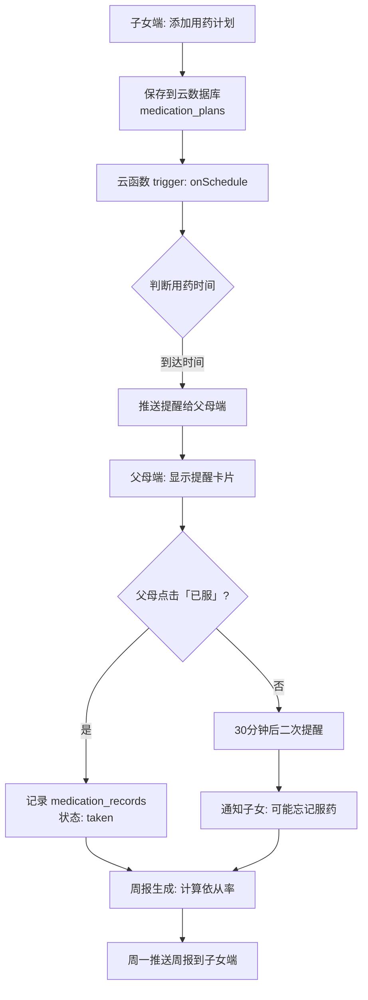
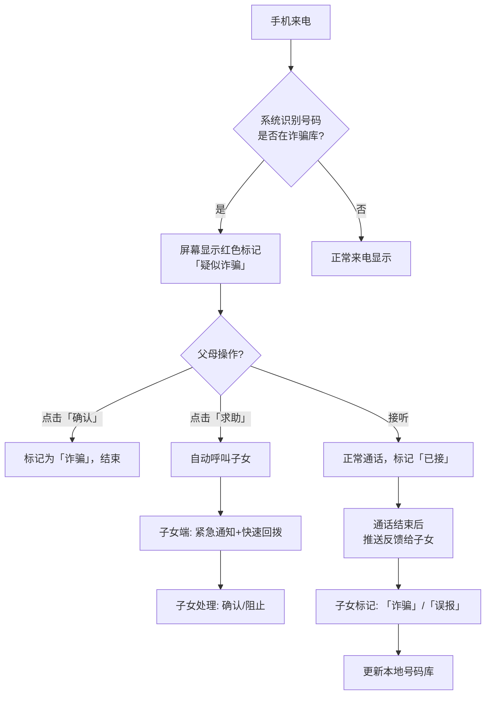
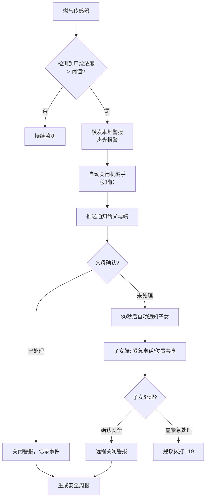

# Phase 1 原型设计文档（用药提醒 + 骗子识别 + 煤气守护）

**项目**：父母这一周  
**版本**：v1.0 - Phase 1（MVP 验证期）  
**日期**：2026-04-16  
**状态**：设计草案

---

## 📐 设计规范

### 视觉风格
- **风格**：极简卡片风 + 高对比度
- **字体**：系统默认（PingFang SC / Roboto），标题 18-20sp，正文 14-16sp
- **配色**：
  - 主色：`#07C160`（微信绿，用于确认、成功）
  - 警示色：`#FA5151`（红色，用于危险、错误）
  - 提醒色：`#FFC300`（黄色，用于待办、警告）
  - 背景：`#F7F7F7`（浅灰）
- **组件**：圆角卡片（12px）、大按钮（最小 44×44pt 触控区）

### 导航结构
```
父母这一周（小程序）
├─ TabBar（4个标签页）
│  ├─ 📋 周报（首页）
│  ├─ 📅 每日小结
│  ├─ 💊 用药统计
│  └─ ⚙️ 设置
│
├─ 页面栈
│  ├─ 用药计划管理（子页面）
│  ├─ 扫码帮手（悬浮按钮触发）
│  ├─ 安全预警中心（独立页面）
│  └─ 家庭绑定流程（首次使用）
```

---

## 🎯 场景 1：用药提醒（核心流程）

### 1.1 流程图（Mermaid）



---

### 1.2 页面线框图与说明

#### 页面 1：用药计划列表（子女端）

```
┌─────────────────────────────────┐
│ 父母这一周          ⚙️          │
├─────────────────────────────────┤
│                                 │
│  ┌───────────────────────────┐ │
│  │ 💊 本周用药计划            │ │
│  │                           │ │
│  │ 周一 08:00  降压药 1片    │ │
│  │       状态: 已完成 ✓      │ │
│  │                           │ │
│  │ 周二 08:00  降压药 1片    │ │
│  │       状态: 待服药 ⏰     │ │
│  │                           │ │
│  │ 周二 20:00  阿司匹林 1片 │ │
│  │       状态: 待服药 ⏰     │ │
│  │                           │ │
│  │ + 添加用药计划            │ │
│  └───────────────────────────┘ │
│                                 │
│ 本周依从率: 80% (4/5)           │
│ 上周对比: ↑10%                  │
│                                 │
└─────────────────────────────────┘
```

**交互说明**：
- 点击「+ 添加用药计划」 → 进入添加页面
- 点击具体计划 → 进入编辑/详情页
- 下拉刷新 → 同步最新状态

---

#### 页面 2：添加/编辑用药计划（子女端）

```
┌─────────────────────────────────┐
│ ← 添加用药计划                 │
├─────────────────────────────────┤
│                                 │
│ 药物名称                        │
│ ┌───────────────────────────┐ │
│ │ 降压药                     │ │
│ └───────────────────────────┘ │
│                                 │
│ 剂量                            │
│ ┌───────────────────────────┐ │
│ │ 1片                        │ │
│ └───────────────────────────┘ │
│                                 │
│ 用药时间                        │
│ ┌───────────────────────────┐ │
│ │ 08:00                      │ │
│ └───────────────────────────┘ │
│                                 │
│ 重复模式                        │
│ ┌───────────────────────────┐ │
│ │ 每天 ▾                     │ │
│ └───────────────────────────┘ │
│                                 │
│ 提醒方式                        │
│ ○ 震动  ○ 语音  ● 震动+语音   │ │
│                                 │
│ ┌───────────────────────────┐ │
│ │       保存计划            │ │
│ └───────────────────────────┘ │
│                                 │
└─────────────────────────────────┘
```

**字段说明**：
- 药物名称：文本输入（最多 10 字）
- 剂量：文本（如「1片」「2粒」「5ml」）
- 时间：时间选择器（24h 制）
- 重复：每天 / 工作日 / 自定义（周一至周日勾选）
- 提醒方式：震动（默认）、语音（需父母授权）

**保存后**：
- 自动同步到父母端
- 生成对应的云函数定时触发器

---

#### 页面 3：用药提醒卡片（父母端）

```
┌─────────────────────────────────┐
│                                 │
│        🔔 用药提醒              │
│                                 │
│        08:00                   │
│                                 │
│  ┌───────────────────────────┐ │
│  │      💊 降压药 1片        │ │
│  │                           │ │
│  │  【已服】  【稍后提醒】    │ │
│  └───────────────────────────┘ │
│                                 │
│ 备注（可选）:                   │
│ ┌───────────────────────────┐ │
│ │                           │ │
│ └───────────────────────────┘ │
│                                 │
└─────────────────────────────────┘
```

**交互流程**：
1. **推送到达**：微信服务通知 + 小程序内卡片
2. **点击通知**：直接打开小程序到该提醒页
3. **点击「已服」**：
   - 立即记录 `medication_records`（taken = true）
   - 子女端实时推送通知
   - 卡片显示 ✅ 已完成（绿色）
4. **点击「稍后提醒」**：
   - 延迟 30 分钟再次提醒
   - 最多延迟 2 次
5. **超时未操作**（2 小时后）：
   - 自动标记为 missed
   - 通知子女「可能忘记服药」

---

#### 页面 4：用药统计（父母/子女端共享）

```
┌─────────────────────────────────┐
│ ← 用药统计                     │
├─────────────────────────────────┤
│                                 │
│ 本周服药情况                    │
│ ┌───────────────────────────┐ │
│ │ 总计划数: 14 次           │ │
│ │ 已服用:   12 次 (85.7%)   │ │
│ │ 漏服:      1 次           │ │
│ │ 延迟:      1 次           │ │
│ └───────────────────────────┘ │
│                                 │
│ 近 4 周趋势                     │
│  [图表] 依从率: 75% → 85% ↑    │
│                                 │
│ 漏服记录                        │
│ ┌───────────────────────────┐ │
│ │ 4月14日 周二 20:00        │ │
│ │ 阿司匹林 1片 — 未服用     │ │
│ └───────────────────────────┘ │
│                                 │
└─────────────────────────────────┘
```

---

### 1.3 数据模型（CloudBase 数据库）

#### Collection: `medication_plans`
```json
{
  "_id": "plan_001",
  "parentId": "user_parent_123",
  "childId": "user_child_456",
  "medication": "降压药",
  "dosage": "1片",
  "time": "08:00",
  "repeat": "daily",
  "enabled": true,
  "reminderType": "vibration+voice",
  "createdAt": "2026-04-10T08:00:00Z",
  "updatedAt": "2026-04-10T08:00:00Z"
}
```

#### Collection: `medication_records`
```json
{
  "_id": "record_001",
  "planId": "plan_001",
  "parentId": "user_parent_123",
  "date": "2026-04-15",
  "status": "taken",  // taken / missed / delayed
  "takenAt": "2026-04-15T08:02:00Z",
  "notes": "饭后服用",
  "syncToChild": true
}
```

---

### 1.4 云函数设计

#### 云函数：`medication`（定时触发器）

**触发规则**：
- Cron: `0 0 8,13,18,22 * * *`（每天 8/13/18/22 点检查）
- 事件：`onSchedule`

**逻辑**：
```javascript
exports.main = async (event) => {
  const now = new Date();
  const today = `${now.getHours().toString().padStart(2,'0')}:00`;
  
  // 查询所有启用的计划
  const plans = await db.collection('medication_plans')
    .where({ enabled: true, time: today })
    .get();
  
  // 发送提醒
  for (let plan of plans) {
    await sendReminder(plan.parentId, plan);
  }
  
  return { sent: plans.length };
};
```

**子函数**：`sendReminder(userId, plan)` → 调用 `wx.cloud.sendMessage()`

---

## 🔔 场景 2：骗子识别（来电预警）

### 2.1 流程图（Mermaid）



---

### 2.2 页面线框图与说明

#### 页面 1：来电预警界面（父母端）

```
┌─────────────────────────────────┐
│                                 │
│   📞  incoming call             │
│                                 │
│   ┌─────────────────────────┐   │
│   │  ⚠️ 疑似诈骗电话         │   │
│   │  号码: 138****8888      │   │
│   │  类型: 冒充公检法        │   │
│   │                         │   │
│   │  [确认是诈骗]  [求助]   │   │
│   │      [接听]             │   │
│   └─────────────────────────┘   │
│                                 │
│ 该号码已被 1,234 人标记为诈骗   │
│                                 │
└─────────────────────────────────┘
```

**交互说明**：
- 来电时自动弹出（需系统权限「来电显示」）
- **「确认是诈骗」**：直接挂断，记录标记
- **「求助」**：自动呼叫绑定的子女（如果多个子女，选择最优先）
- **「接听」**：正常通话，通话结束后推送反馈给子女

---

#### 页面 2：骗子识别记录（子女端）

```
┌─────────────────────────────────┐
│ ← 诈骗预警记录                 │
├─────────────────────────────────┤
│                                 │
│ 今日预警: 2 次                 │
│                                 │
│ ┌───────────────────────────┐ │
│ │ ⚠️ 14:25                 │ │
│ │ 号码: 138****8888        │ │
│ │ 类型: 冒充客服            │ │
│ │ 处理: 父亲点击「求助」    │ │
│ │ 状态: ✅ 已确认为诈骗     │ │
│ └───────────────────────────┘ │
│                                 │
│ ┌───────────────────────────┐ │
│ │ ⚠️ 10:12                 │ │
│ │ 号码: 010****5678        │ │
│ │ 类型: 冒充公检法          │ │
│ │ 处理: 自动拦截            │ │
│ │ 状态: ⏳ 待确认           │ │
│ └───────────────────────────┘ │
│                                 │
│ [误报? 点击反馈]               │
│                                 │
└─────────────────────────────────┘
```

**功能**：
- 显示所有预警记录（日期、号码、类型、处理状态）
- 点击单条可查看详情（通话时长、父母操作记录）
- 提供「误报反馈」按钮，优化识别模型

---

#### 页面 3：诈骗类型标签页（设置页子项）

```
┌─────────────────────────────────┐
│ ← 预警类型管理                 │
├─────────────────────────────────┤
│                                 │
│ 选择需要预警的诈骗类型:         │
│                                 │
│ ☑️ 冒充公检法                   │ │
│ ☑️ 冒充客服/退款                │ │
│ ☑️ 虚假中奖                     │ │
│ ☑️ 冒充领导/熟人                │ │
│ ☑️ 投资理财诈骗                 │ │
│ ☐ 商业推销（可选关闭）          │ │
│ ☐ 房产中介（可选关闭）          │ │
│                                 │
│ 保存设置                        │
│                                 │
└─────────────────────────────────┘
```

---

### 2.3 数据模型

#### Collection: `secure_calls`
```json
{
  "_id": "call_001",
  "phoneNumber": "13800138000",
  "parentId": "user_parent_123",
  "timestamp": "2026-04-15T14:25:00Z",
  "type": "impersonation_police",  // 诈骗类型
  "riskLevel": "high",  // high/medium/low
  "action": "help_request",  // confirmed/help/ignored/answered
  "childNotified": true,
  "childResponse": "confirmed",  // confirmed/false_alarm
  "duration": 0,  // 通话时长（秒），0 表示未接听
  "markedBy": "parent"  // parent/child/system
}
```

---

### 2.4 云函数设计

#### 云函数：`secure`（监听来电事件）

**触发器**：云函数定时轮询（每 5 分钟）或系统事件（如有权限）

**逻辑**：
```javascript
// 伪代码
exports.main = async (event) => {
  const { phoneNumber, parentId } = event;
  
  // 1. 查询本地号码库
  const local = await checkLocalDB(phoneNumber);
  if (local.riskLevel === 'high') return { risk: 'high', type: local.type };
  
  // 2. 查询第三方 API（如腾讯云、阿里云号码识别）
  const apiResult = await queryThirdPartyAPI(phoneNumber);
  
  // 3. 判断并缓存结果
  if (apiResult.isFraud) {
    await cacheToLocalDB(phoneNumber, apiResult.type, 'high');
    return { risk: 'high', type: apiResult.type };
  }
  
  return { risk: 'low' };
};
```

**通知推送**：
- 高风险 → 强提醒（震动 + 弹窗）
- 中风险 → 弱提醒（静默通知）
- 低风险 → 不提醒

---

## 🔥 场景 3：煤气守护（传感器联动）

### 3.1 流程图（Mermaid）



---

### 3.2 页面线框图与说明

#### 页面 1：安全看板（子女端）

```
┌─────────────────────────────────┐
│ ← 父母安全状态                 │
├─────────────────────────────────┤
│                                 │
│  👨 父亲  【家】               │
│  ───────────────────────────   │
│  🟢 煤气: 正常（最后检查: 2分钟前）│
│  🔴 火灾: 正常                  │
│  🟢 水浸: 正常                  │
│  📍 位置: 在家 / 外出?          │
│                                 │
│  👩 母亲  【家】               │
│  ───────────────────────────   │
│  🟢 煤气: 正常                  │
│  🟡 门窗: 已开（22:00）         │
│  📍 位置: 外出（最后更新: 19:30）│
│                                 │
│ 历史记录                        │
│ ┌───────────────────────────┐ │
│ │ 4月15日 08:30 煤气正常     │ │
│ │ 4月14日 22:15 门窗关闭     │ │
│ │ 4月14日 19:20 父亲外出     │ │
│ └───────────────────────────┘ │
│                                 │
└─────────────────────────────────┘
```

**状态标识**：
- 🟢 绿色：正常
- 🟡 黄色：预警（如门窗长时间打开）
- 🔴 红色：危险（煤气泄漏、火灾）

---

#### 页面 2：煤气预警处理（父母端）

```
┌─────────────────────────────────┐
│ ⚠️ 煤气泄漏警报！              │
├─────────────────────────────────┤
│                                 │
│ 检测到厨房煤气浓度超标！        │
│                                 │
│ 当前浓度: 1200 PPM<br/>（安全阈值: 500）│
│                                 │
│ ┌───────────────────────────┐ │
│ │ 🔴 立即开窗通风           │ │
│ │ 🔴 关闭燃气阀门           │ │
│ │ 🔴 不要开关任何电器        │ │
│ └───────────────────────────┘ │
│                                 │
│ 我已处理 ☑️                   │
│ 呼叫子女帮忙 📞               │
│                                 │
│ 倒计时: 30 秒后自动通知子女    │
│                                 │
└─────────────────────────────────┘
```

**操作流程**：
1. 弹出全屏警报（无法关闭）
2. 语音播报提示（「煤气泄漏，请立即开窗」）
3. 父母操作：
   - **「我已处理」**：点击后倒计时停止，记录事件，通知子女「已处理」
   - **「呼叫子女」**：直接拨打子女电话，同时通知子女「父母求助」
4. 倒计时结束未操作 → 自动通知子女并拨打 119（需预先授权）

---

#### 页面 3：安全事件记录（子女端）

```
┌─────────────────────────────────┐
│ ← 安全事件记录                 │
├─────────────────────────────────┤
│                                 │
│ ┌───────────────────────────┐ │
│ │ 🔴 4月15日 08:30          │ │
│ │ 煤气泄漏（浓度 1200 PPM） │ │
│ │ 地点: 厨房                │ │
│ │ 处理: 父亲点击「我已处理」│ │
│ │ 结果: ✅ 安全，无事故     │ │
│ └───────────────────────────┘ │
│                                 │
│ ┌───────────────────────────┐ │
│ │ 🟡 4月12日 22:15          │ │
│ │ 窗户开启超时（2小时）     │ │
│ │ 处理: 自动关闭            │ │
│ │ 结果: ⚠️ 已关闭           │ │
│ └───────────────────────────┘ │
│                                 │
│ 月度安全评分: 92 分（优秀）    │ │
│                                 │
└─────────────────────────────────┘
```

---

### 3.3 数据模型

#### Collection: `safety_events`
```json
{
  "_id": "event_001",
  "parentId": "user_parent_123",
  "type": "gas_leak",  // gas_leak/fire/flood/window_open
  "sensorValue": 1200,  // 传感器读数
  "threshold": 500,  // 报警阈值
  "location": "kitchen",
  "timestamp": "2026-04-15T08:30:00Z",
  "parentAction": "acknowledged",  // acknowledged/ignored/call_for_help
  "childNotified": true,
  "childResponse": "remote_shutdown",  // remote_shutdown/call_119/acknowledged
  "resolved": true,
  "duration": 45  // 事件持续时长（秒）
}
```

---

## 🎨 统一组件库（Phase 1 使用）

### 按钮组件

```
┌─────────────────────────────────┐
│  主要按钮 (Primary)             │
│  ┌───────────────────────────┐ │
│  │     保存计划              │ │
│  └───────────────────────────┘ │
│  背景: #07C160  字体: 白色      │
│                                 │
│  次要按钮 (Secondary)           │
│  ┌───────────────────────────┐ │
│  │    取消                   │ │
│  └───────────────────────────┘ │
│  背景: 透明  边框: #E5E5E5     │
│                                 │
│  危险按钮 (Danger)              │
│  ┌───────────────────────────┐ │
│  │    删除计划              │ │
│  └───────────────────────────┘ │
│  背景: #FA5151  字体: 白色      │
└─────────────────────────────────┘
```

### 卡片组件

```
┌─────────────────────────────────┐
│  🏷️ 标题                       │
│  内容描述文字...                │
│                                 │
│  ┌───────────────────────────┐ │
│  │  操作按钮                  │ │
│  └───────────────────────────┘ │
└─────────────────────────────────┘
圆角: 12px  阴影: 0 2px 8px rgba(0,0,0,0.06)
内边距: 16px
```

---

## 📱 页面路由配置

在 `app.json` 中新增页面：

```json
{
  "pages": [
    "pages/index/index",              // 周报首页
    "pages/daily/daily",              // 每日小结
    "pages/medication/medication",    // 用药统计
    "pages/settings/settings",        // 设置
    "pages/medication/list",          // 用药计划列表
    "pages/medication/add",           // 添加用药计划
    "pages/secure/center",            // 安全预警中心
    "pages/secure/detail",            // 安全事件详情
    "pages/help/scan"                 // 扫码帮手
  ]
}
---

## ✅ 原型设计完成清单

### 用药提醒场景
- [x] 流程图（完整状态机）
- [x] 4 个页面线框图（列表、添加、提醒卡片、统计）
- [x] 数据模型（2 个 Collection）
- [x] 云函数设计（定时触发器）
- [x] 交互逻辑说明

### 骗子识别场景
- [x] 流程图（来电处理流）
- [x] 3 个页面线框图（来电弹窗、记录列表、类型管理）
- [x] 数据模型（1 个 Collection）
- [x] 云函数设计（来电识别）
- [x] 交互逻辑说明

### 煤气守护场景
- [x] 流程图（传感器联动）
- [x] 3 个页面线框图（安全看板、预警处理、事件记录）
- [x] 数据模型（1 个 Collection）
- [x] 传感器阈值设定（浓度 500 PPM）
- [x] 交互逻辑说明

---

## 🚀 下一步

1. **UI 设计**：基于线框图输出高保真视觉稿（Figma）
2. **交互原型**：使用 Figma Prototype 或 ProtoPie 制作可交互 demo
3. **技术评审**：
   - 数据库 schema 确认
   - 云函数权限配置
   - 传感器硬件选型（煤气传感器、紧急呼叫设备）
4. **开发排期**：按用户故事优先级拆解任务（Phase 1 预计 4 周）

---

**文档维护**：@aitogether  
**最后更新**：2026-04-16
