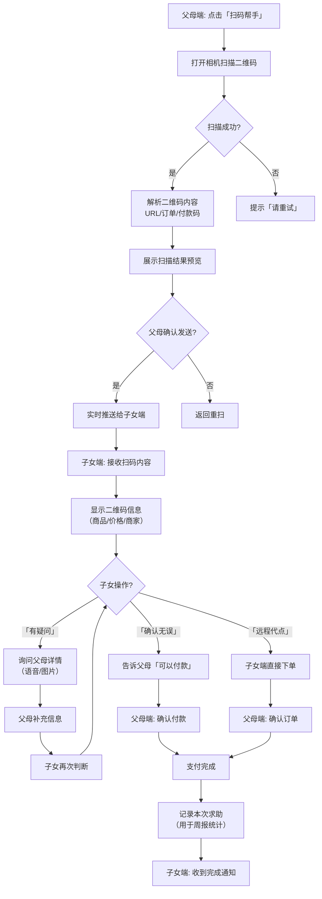

# 原型设计：扫码帮手（远程扫码协助）

**项目**：父母这一周  
**场景**：情感连接 - 扫码帮手  
**优先级**：P1（高频）  
**日期**：2026-04-16  
**状态**：设计草案

---

## 🎯 场景定义

### 核心问题
- 父母不会扫码点餐/付款
- 老人被商家欺骗多收费
- 子女无法远程协助（只能电话描述）
- 父母怕麻烦别人，不敢求助

### 解决方案
「扫码帮手」：父母端扫码 → 子女端实时查看 → 远程代操作

### 设计原则
- **一键发起**：父母端只需点击「扫码求助」→ 扫描二维码
- **实时同步**：扫码内容秒级推送到子女端
- **远程代点**：子女端可直接提交订单（需父母确认）
- **隐私保护**：扫码内容不存储，仅用于本次会话

---

## 🔄 完整流程图（Mermaid）



---

## 📱 页面线框图与说明

### 页面 1：扫码帮手入口（父母端 - 悬浮按钮）

```
┌─────────────────────────────────┐
│ 每日小结                       │
├─────────────────────────────────┤
│                                 │
│  今日步数: 3,456 步            │
│  今日用药: 已完成 2/3          │
│  心情记录: 😊                  │
│                                 │
│ ┌───────────────────────────┐ │
│ │ 🆘 扫码求助               │ │
│ │ 点餐/付款/挂号 一键协助    │ │
│ └───────────────────────────┘ │
│                                 │
│ 常去区域                        │
│ ...                            │
│                                 │
│ ┌───────────────────────────┐ │
│ │ 🏠 在家  ● 外出           │ │
│ └───────────────────────────┘ │
│                                 │
└─────────────────────────────────┘
```

**说明**：
- 悬浮按钮常驻底部（除某些页面外）
- 点击 → 打开相机扫描二维码
- 支持场景：点餐、付款、挂号、地铁码等

---

### 页面 2：扫码预览（父母端）

```
┌─────────────────────────────────┐
│ ← 扫码求助                     │
├─────────────────────────────────┤
│                                 │
│ ✅ 二维码识别成功！            │
│                                 │
│ 内容类型: 微信付款码           │
│                                 │
│ ┌───────────────────────────┐ │
│ │ 商家: 幸福路菜市场        │ │
│ │ 金额: ￥28.50             │ │
│ │ 时间: 2026-04-15 14:30   │ │
│ └───────────────────────────┘ │
│                                 │
│ [重新扫描]                     │
│                                 │
│ ┌───────────────────────────┐ │
│ │ 📤 发送给儿子（张伟）      │ │
│ │ 他可以帮助你确认是否安全  │ │
│ └───────────────────────────┘ │
│                                 │
└─────────────────────────────────┘
```

**交互**：
1. 扫描后自动解析内容
2. 显示关键信息（商家、金额、时间）
3. 点击「发送给儿子」 → 实时推送
4. 或「重新扫描」

---

### 页面 3：子女端接收通知

```
┌─────────────────────────────────┐
│ ← 扫码求助                     │
├─────────────────────────────────┤
│                                 │
│ 🆘 父亲发起扫码求助            │
│ 时间: 14:30                   │
│                                 │
│ ┌───────────────────────────┐ │
│ │ 📱 扫码内容:             │ │
│ │                          │ │
│ │ 商家: 幸福路菜市场       │ │
│ │ 金额: ￥28.50            │ │
│ │ 类型: 微信付款码         │ │
│ │                          │ │
│ │ [查看完整二维码]         │ │
│ └───────────────────────────┘ │
│                                 │
│ ┌───────────────────────────┐ │
│ │ 💬 消息: 「帮我看看这个多少钱」│ │
│ │ 来自: 父亲               │ │
│ └───────────────────────────┘ │
│                                 │
│ ┌───────────────────────────┐ │
│ │ ✅ 确认无误               │ │
│ │ ❓ 还有疑问               │ │
│ │ 🛒 远程代付               │ │
│ └───────────────────────────┘ │
│                                 │
└─────────────────────────────────┘
```

**功能**：
- 显示扫码内容摘要
- 显示父母留言（可选）
- 三个操作按钮：确认、询问、代付

---

### 页面 4：远程代付确认（父母端）

```
┌─────────────────────────────────┐
│ ← 扫码求助                     │
├─────────────────────────────────┤
│                                 │
│ 儿子已确认: 「可以付款」        │
│                                 │
│ ┌───────────────────────────┐ │
│ │ 商家: 幸福路菜市场        │ │
│ │ 金额: ￥28.50             │ │
│ │ 支付方式: 微信支付        │ │
│ └───────────────────────────┘ │
│                                 │
│ ┌───────────────────────────┐ │
│ │ ✅ 确认支付               │ │
│ │ ❌ 取消支付               │ │
│ └───────────────────────────┘ │
│                                 │
│ 或手动输入密码支付              │
│                                 │
└─────────────────────────────────┘
```

**流程**：
1. 子女点击「远程代付」 → 生成支付订单
2. 父母端收到确认页（显示金额、商家）
3. 父母点击「确认支付」 → 调起微信支付
4. 支付成功 → 双方收到通知

---

### 页面 5：求助历史（父母/子女端）

```
┌─────────────────────────────────┐
│ ← 扫码求助记录                 │
├─────────────────────────────────┤
│                                 │
│ 本周求助: 3 次                 │
│                                 │
│ ┌───────────────────────────┐ │
│ │ 4月15日 14:30            │ │
│ │ 菜市场付款 ￥28.50 ✓     │ │
│ │ 处理: 儿子确认           │ │
│ └───────────────────────────┘ │
│                                 │
│ ┌───────────────────────────┐ │
│ │ 4月12日 10:15            │ │
│ │ 餐厅点餐 ✓               │ │
│ │ 处理: 儿子远程代点       │ │
│ └───────────────────────────┘ │
│                                 │
│ ┌───────────────────────────┐ │
│ │ 4月10日 09:00            │ │
│ │ 医院挂号 ✓               │ │
│ │ 处理: 自行完成           │ │
│ └───────────────────────────┘ │
│                                 │
│ 常求助场景: 菜市场(2) 医院(1)  │ │
│                                 │
└─────────────────────────────────┘
```

---

## 💾 数据模型

### Collection: `scan_requests`
```json
{
  "_id": "scan_001",
  "parentId": "user_parent_123",
  "childId": "user_child_456",
  "type": "payment",  // payment/order/checkin/other
  "qrContent": "weixin://wxpay/bizpayurl?pr=xxxxx",
  "parsed": {
    "merchant": "幸福路菜市场",
    "amount": 28.50,
    "timestamp": "2026-04-15T14:30:00Z"
  },
  "status": "completed",  // pending/confirmed/paid/cancelled
  "parentMessage": "帮我看看这个多少钱",
  "childAction": "confirmed",  // confirmed/remote_pay/ask_more
  "createdAt": "2026-04-15T14:30:00Z",
  "resolvedAt": "2026-04-15T14:32:00Z"
}
```

### Collection: `scan_stats`
```json
{
  "_id": "stat_001",
  "parentId": "user_parent_123",
  "week": "2026-W15",
  "totalRequests": 3,
  "byType": {
    "payment": 2,
    "order": 1,
    "checkin": 0
  },
  "successRate": 1.0,
  "avgResolutionTime": 120  // 秒
}
```

---

## ☁️ 云函数设计

### 云函数：`scan-parse`（父母端调用）

```javascript
exports.main = async (event) => {
  const { parentId, qrContent, imageBase64 } = event;
  
  // 1. 解析二维码内容
  let parsed = {};
  if (qrContent.startsWith('weixin://wxpay')) {
    parsed = parseWeChatPayQR(qrContent);
  } else if (isURL(qrContent)) {
    parsed = await fetchPageInfo(qrContent);
  }
  
  // 2. 保存请求记录
  const request = await db.collection('scan_requests').add({
    data: {
      parentId,
      qrContent,
      parsed,
      status: 'pending',
      createdAt: new Date()
    }
  });
  
  // 3. 推送给子女端
  await sendToChild(parentId, 'scan_request', {
    requestId: request._id,
    parsed,
    timestamp: new Date()
  });
  
  return { success: true, requestId: request._id };
};
```

### 云函数：`scan-respond`（子女端调用）

```javascript
exports.main = async (event) => {
  const { requestId, childId, action, message } = event;
  
  // 1. 更新请求状态
  await db.collection('scan_requests').doc(requestId).update({
    data: {
      childId,
      childAction: action,
      childMessage: message,
      resolvedAt: new Date()
    }
  });
  
  // 2. 通知父母端
  await sendToParent(requestId, 'scan_response', { action, message });
  
  return { success: true };
};
```

---

## 🎯 关键指标

| 指标 | 目标值 |
|------|--------|
| 扫码成功率 | > 95% |
| 子女响应时间 | < 2 分钟 |
| 问题解决率 | > 90% |
| 平均求助频率 | 2-3 次/周/家庭 |
| 误报率（非求助场景）| < 10% |

---

## 🔒 安全与隐私

### 数据安全
- 扫码内容 **不存储** 原始二维码（仅解析后的摘要）
- 会话结束后 24 小时自动删除记录
- 子女端无法查看历史扫码内容（只能看统计）

### 防滥用
- 每日求助上限：10 次（防刷）
- 相同二维码 5 分钟内不重复推送
- 可疑支付码（大额）强制二次确认

---

## 🎨 原型设计完成清单

- [x] 完整流程图（Mermaid）
- [x] 5 个页面线框图（悬浮入口、扫码预览、子女接收、代付确认、求助历史）
- [x] 数据模型（2 个 Collection）
- [x] 云函数设计（2 个：parse、respond）
- [x] 关键指标（5 项）
- [x] 安全措施（数据清理、防滥用）

---

**文件名**：`prototype-scan-helper.md`  
**维护者**：@aitogether  
**最后更新**：2026-04-16
