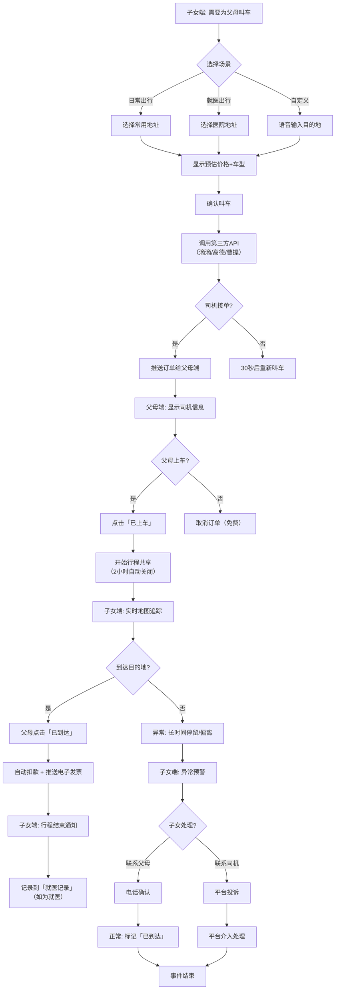

# 原型设计：叫车帮手（出行协助）

**项目**：父母这一周  
**场景**：出行协助 - 叫车帮手  
**优先级**：P2（重要）  
**日期**：2026-04-16  
**状态**：设计草案

---

## 🎯 场景定义

### 核心问题
- 父母不会使用滴滴/高德打车 App
- 老人被司机绕路、多收费
- 子女无法确认父母是否安全到家
- 父母说不清目的地地址

### 解决方案
「叫车帮手」：子女远程代叫车 + 实时行程共享 + 费用透明化

### 设计原则
- **子女代叫为主**：父母只需确认上车
- **一键呼叫**：减少输入，语音/地址簿选择目的地
- **行程透明**：子女实时查看轨迹
- **费用可控**：预估价显示，避免纠纷

---

## 🔄 完整流程图（Mermaid）



---

## 📱 页面线框图与说明

### 页面 1：叫车主页（子女端）

```
┌─────────────────────────────────┐
│ ← 为父母叫车                   │
├─────────────────────────────────┤
│                                 │
│ 谁乘车?                         │
│ ┌───────────────────────────┐ │
│ │ ● 父亲                     │ │
│ │ ○ 母亲                     │ │
│ │ ○ 两人                     │ │
│ └───────────────────────────┘ │
│                                 │
│ 去哪裡?                         │
│ ┌───────────────────────────┐ │
│ │ 家 → 市立医院             │ │
│ │ 📍 幸福路123号            │ │
│ │ 🏥 心血管内科             │ │
│ └───────────────────────────┘ │
│                                 │
│ ┌───────────────────────────┐ │
│ │ + 使用地址簿              │ │
│ │ 🎤 语音输入目的地          │ │
│ └───────────────────────────┘ │
│                                 │
│ ┌───────────────────────────┐ │
│ │ 💰 预估费用: 28-35 元     │ │
│ │ ⏱️  预计等待: 3 分钟      │ │
│ │ 🚕 车型: 快车/专车        │ │
│ └───────────────────────────┘ │
│                                 │
│ ┌───────────────────────────┐ │
│ │       叫车                │ │
│ └───────────────────────────┘ │
│                                 │
└─────────────────────────────────┘
```

**功能**：
- 选择乘车人（父亲/母亲/两人）
- 目的地选择：常用地址 + 地址簿 + 语音输入
- 显示预估价格、等待时间、车型
- 点击叫车 → 调用第三方 API

---

### 页面 2：订单进行中（父母端）

```
┌─────────────────────────────────┐
│ ← 去市立医院                   │
├─────────────────────────────────┤
│                                 │
│ 🚕 司机: 王师傅                 │
│ ⭐ 4.9 (2,345 单)              │
│ 📱 车牌: 京A·88888            │
│                                 │
│ ┌───────────────────────────┐ │
│ │ 📞 联系司机: 138****1234  │ │
│ └───────────────────────────┘ │
│                                 │
│ 预计到达: 5 分钟                │
│                                 │
│ ┌───────────────────────────┐ │
│ │ ✅ 我已上车                │ │
│ │ ⏳ 等待中...              │ │
│ │ ❌ 取消订单                │ │
│ └───────────────────────────┘ │
│                                 │
│ 行程已共享给儿子（张伟）        │
│ 可随时查看实时位置              │
│                                 │
└─────────────────────────────────┘
```

**交互**：
- 显示司机信息、车牌、评分
- 点击「我已上车」 → 开始行程共享
- 子女端实时查看地图

---

### 页面 3：行程追踪（子女端）

```
┌─────────────────────────────────┐
│ ← 追踪父母行程                 │
├─────────────────────────────────┤
│                                 │
│    [地图显示]                   │
│    🚗 父母车辆 (移动中)         │
│    距目的地: 2.1km             │
│    ETA: 8 分钟                  │
│                                 │
│ ┌───────────────────────────┐ │
│ │ 👨 父亲 正在乘车          │ │
│ │ 🚕 王师傅 京A·88888      │ │
│ │ 💰 预估: 32 元           │ │
│ │ 📞 联系父亲: 138****5678 │ │
│ └───────────────────────────┘ │
│                                 │
│ 行程历史                        │
│ 14:25 父亲叫车（家 → 医院）    │
│ 14:30 司机到达，父亲上车       │
│ 14:32 行程开始                 │
│                                 │
└─────────────────────────────────┘
```

---

### 页面 4：行程结束（子女端）

```
┌─────────────────────────────────┐
│ ← 行程已结束                   │
├─────────────────────────────────┤
│                                 │
│ ✅ 父母已安全到达              │
│                                 │
│ 行程详情                        │
│ ┌───────────────────────────┐ │
│ │ 起点: 幸福路123号（家）   │ │
│ │ 终点: 市立医院            │ │
│ │ 距离: 6.8km              │ │
│ │ 时长: 18 分钟            │ │
│ │ 费用: 32 元              │ │
│ │ 支付方式: 微信支付       │ │
│ └───────────────────────────┘ │
│                                 │
│ [查看发票] [再次叫车]          │
│                                 │
│ 本次评分: ⭐⭐⭐⭐⭐            │
│                                 │
└─────────────────────────────────┘
```

---

## 💾 数据模型

### Collection: `ride_orders`
```json
{
  "_id": "order_001",
  "parentId": "user_parent_123",
  "childId": "user_child_456",
  "status": "in_progress",  // pending/ongoing/completed/cancelled
  "pickupAddress": "幸福路123号",
  "dropoffAddress": "市立医院",
  "pickupLat": 39.9042,
  "pickupLng": 116.4074,
  "dropoffLat": 39.9100,
  "dropoffLng": 116.4150,
  "driver": {
    "name": "王师傅",
    "phone": "13800138000",
    "plateNumber": "京A·88888",
    "rating": 4.9
  },
  "estimatedPrice": 32,
  "actualPrice": 32,
  "distance": 6800,
  "duration": 1080,
  "platform": "didache",  // didache/gaode/caocao
  "orderId": "DD123456789",
  "createdAt": "2026-04-15T14:25:00Z",
  "startedAt": "2026-04-15T14:30:00Z",
  "completedAt": "2026-04-15T14:48:00Z"
}
```

### Collection: `ride_locations`
```json
{
  "_id": "loc_001",
  "orderId": "order_001",
  "parentId": "user_parent_123",
  "latitude": 39.9042,
  "longitude": 116.4074,
  "timestamp": "2026-04-15T14:35:00Z",
  "speed": 35,
  "heading": 90
}
```

### Collection: `address_book`
```json
{
  "_id": "addr_001",
  "userId": "user_child_456",
  "name": "家",
  "address": "幸福路123号",
  "latitude": 39.9042,
  "longitude": 116.4074,
  "tags": ["home", "常用"],
  "createdAt": "2026-04-01T00:00:00Z"
}
```

---

## ☁️ 云函数设计

### 云函数：`taxi-call`（子女端调用）

```javascript
exports.main = async (event) => {
  const { childId, parentId, pickup, dropoff, platform } = event;
  
  // 1. 调用第三方打车 API
  const order = await callTaxiAPI({
    pickup,
    dropoff,
    passenger: { name: '父亲', phone: parentPhone }
  });
  
  // 2. 保存订单到数据库
  await db.collection('ride_orders').add({
    data: {
      parentId, childId,
      ...order,
      createdAt: new Date()
    }
  });
  
  // 3. 推送订单给父母端
  await sendMessageToParent(parentId, {
    type: 'ride_order',
    orderId: order.id,
    driver: order.driver
  });
  
  return { success: true, orderId: order.id };
};
```

### 云函数：`taxi-track`（行程中更新）

**触发**：WebSocket 或定时推送（每 30 秒）

```javascript
exports.main = async (event) => {
  const { orderId, latitude, longitude, speed } = event;
  
  // 保存轨迹点
  await db.collection('ride_locations').add({
    data: { orderId, latitude, longitude, speed, timestamp: new Date() }
  });
  
  // 实时推送给子女端
  await sendToChild(orderId, 'location_update', { latitude, longitude });
  
  return { success: true };
};
```

---

## 🔌 第三方 API 集成

### 选项 1：滴滴开放平台
- **费用**：按单结算，约 1-2 元/单
- **功能**：叫车、订单查询、实时位置
- **限制**：需企业资质，个人开发者不可用

### 选项 2：高德打车（聚合平台）
- **费用**：免费（用户支付车费）
- **功能**：多平台同时叫车（滴滴、曹操、T3）
- **限制**：需申请接入，审核周期 1-2 周

### 选项 3：曹操出行 API
- **费用**：免费
- **功能**：专车叫车
- **限制**：城市覆盖有限

**推荐**：高德打车聚合方案（覆盖广、成本低）

---

## 💰 费用与结算

### 支付流程
1. 子女端叫车 → 预授权冻结金额（或信用免押）
2. 行程结束 → 自动扣款
3. 电子发票推送至子女端

### 结算方式
- **方案 A**：子女账户余额（预充值）
- **方案 B**：微信支付分（先乘后付）
- **方案 C**：月结账单（次月统一结算）

**推荐**：方案 B（微信支付分，无需充值，用户体验好）

---

## 📊 关键指标

| 指标 | 目标值 |
|------|--------|
| 叫车成功率 | > 95% |
| 司机接单时间 | < 3 分钟 |
| 行程准时率 | > 90% |
| 费用偏差率 | < 5%（预估 vs 实际） |
| 父母端操作步骤 | < 2 步（上车确认） |

---

## ⚠️ 边界情况

| 场景 | 处理 |
|------|------|
| 父母未上车 | 5 分钟后自动取消，不扣费 |
| 司机绕路 | 子女可投诉，平台补偿 |
| 父母手机没电 | 提前通知子女，取消订单 |
| 网络中断 | 离线模式：记录订单，联网后同步 |
| 多人同时叫车 | 互斥锁：只有一个订单生效 |

---

## 🎨 原型设计完成清单

- [x] 完整流程图（Mermaid）
- [x] 4 个页面线框图（叫车主页、订单中、行程追踪、结束页）
- [x] 数据模型（3 个 Collection）
- [x] 云函数设计（2 个：call、track）
- [x] 第三方 API 集成方案（高德聚合）
- [x] 支付结算方案（微信支付分）
- [x] 关键指标（5 项）
- [x] 边界处理（5 种）

---

**文件名**：`prototype-taxi-helper.md`  
**维护者**：@aitogether  
**最后更新**：2026-04-16
