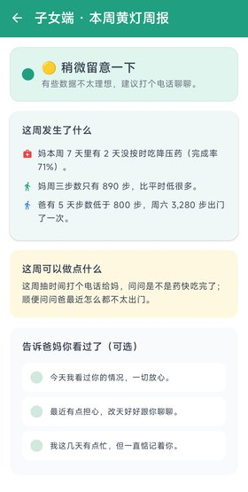
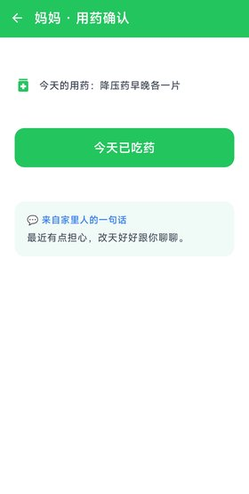
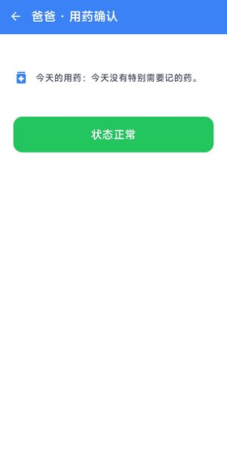
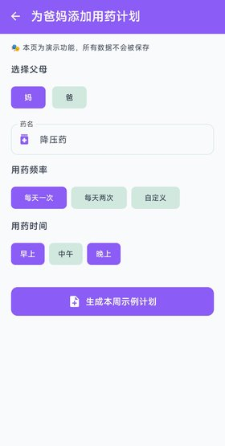

# 父母周报 · Parents Weekly Briefing

> **状态：2026-03 正在寻找 5–10 个愿意尝试的家庭内测。**

<p align="center">
  
</p>

<p align="center">
  <strong>让关心不再距离遥远</strong><br/>
  Weekly health briefing for families — gentle, respectful, no surveillance.
</p>

---

## 📸 Screenshots

| 周报详情 | 用药确认 | 用药计划 | 回声结果 |
| --- | --- | --- | --- |
|  |  |  |  |

> 📷 Android 真机截图（2026-03-24）。所有数据均为演示数据，不代表真实用户情况，也不构成任何医疗建议。

## 产品是什么？

父母周报是一个**轻量级家庭健康关怀工具**，面向异地子女和年迈父母：

| 角色 | 体验 |
|------|------|
| 👶 子女端 | 每周收到一份**黄灯周报**：父母步数趋势 + 用药情况 + AI 建议，一键发送「回声」 |
| 👴👵 父母端 | 大按钮确认用药，不需要打字，不需要学习新操作 |

**核心理念**：不是监控，是关心。用**周报**代替实时监控，用**一句话回声**代替长消息轰炸。

## 仓库结构

```
parents-weekly-briefing/
├── docs/                    # 产品文档 & 设计规范
│   ├── ui/color-palette.md  # 全端色板规范
│   ├── design-brief.md      # 设计简报
│   └── icon-guidelines.md   # 图标指南
├── miniprogram/             # 微信小程序源码
│   ├── pages/report/        # 周报页面
│   └── styles/              # 全局样式（色板变量）
├── ui-prototype/            # HTML 高保真原型
│   └── index.html           # 可直接打开的手机模拟器
└── LICENSE                  # CC BY-NC 4.0 + 商业授权
```

## 快速体验

### HTML 原型
直接在浏览器打开 `ui-prototype/index.html`，即可看到完整的 4 个页面（周报/日结/用药/设置）。

### Demo App
独立的 Android 演示应用，纯本地假数据，不联网：
→ [parents-weekly-briefing-demo-app](https://github.com/aitogether/parents-weekly-briefing-demo-app)

## 配色方案

<p align="center">
   BrandTeal #20A080
  &nbsp;&nbsp;
   BrandMint #70E090
  &nbsp;&nbsp;
   HeartRed #E84040
</p>

完整色板定义 → [docs/ui/color-palette.md](docs/ui/color-palette.md)

---

## Commercial use & branding

### Personal / non-commercial use

This project is open source and welcomes personal and non-commercial use.

If you are an individual using this project for yourself, your family, or non-profit / research purposes, you can use, modify, and deploy it freely under the [CC BY-NC 4.0](LICENSE) license.

We appreciate attribution (linking back to this repo), but it is not required for private use.

### Commercial use

If you plan to integrate this project into a paid product or service, or deploy it as part of a commercial offering (e.g. SaaS for caregivers, hospital / clinic deployments, insurance / eldercare bundles), **please contact the author to discuss a commercial license or revenue-sharing agreement**.

This helps sustain continued development and ensures the product is used in a way that respects the values behind "Parents Weekly Briefing".

### Branding & naming

The names 「父母周报」 and "Parents Weekly Briefing", as well as related logos / icons used in this repository, are reserved as project branding.

You may not use these names or logos in a way that suggests your product is the "official" Parents Weekly Briefing without prior written permission.

If you build on this project commercially, please use your own product name and branding, unless we explicitly agree otherwise.

### 联系 / Contact

For questions about acceptable use, commercial licensing, or partnership inquiries, feel free to open an issue or reach out directly.

---

## License

[CC BY-NC 4.0](LICENSE) — 个人非商业使用免费，商业使用请联系作者。

*个人随便用，赚钱要谈。*
